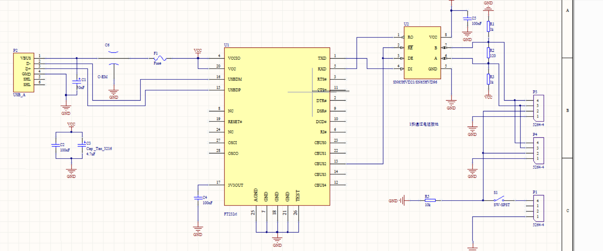

## ZJUDancer电路部分题目

### 绘制电路板

小型仿人机器人所使用的动力来源是Dynamixel系列的舵机，该舵机MX-64型号提供了[用户手册](http://support.robotis.com/en/product/actuator/dynamixel/mx_series/mx-64(2.0).htm)，在实际使用过程中我们需要对每一个舵机都进行ID以及其他参数的配置。发行公司ROBOTIS提供了一个烧录参数的[软件](http://www.robotis.us/dynamixel-wizard-2-0/)，但是硬件层面上并没有进行支持。舵机使用的通信协议为RS-485协议，为了方便烧录，需要设计一块电路板，将USB信号转换为485信号。目前使用的USB-485转换板的电路[原理图](./assets/USB2RS485_electric_schematic_diagram.png)如下所示，可以使用目前所使用的芯片方案来实现功能，也可以自己查询资料配置芯片实现转换功能。同时，需要绘制一块PCB电路板。在保证功能前提下做到越小越好。

---

针对以上题目描述，如有疑问请联系邮箱elkulasjiang@zju.edu.cn。