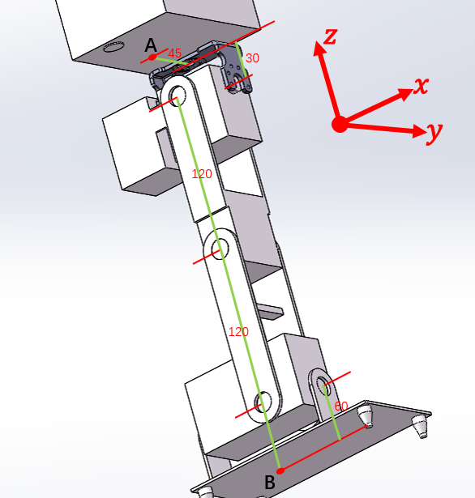
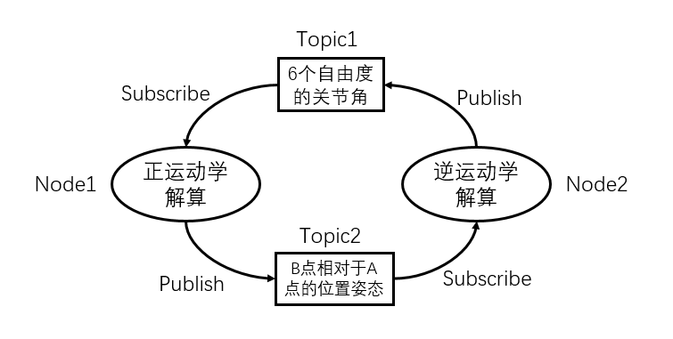

## ZJUDancer步态部分题目

步态动作规划是仿人机器人完成双足行走的必要环节，主要需要机器人学中的运动学和动力学的相关知识，建议参考以下资料：

- [仿人机器人（中文版）](./reference/Gait/仿人机器人+（日）梶田秀司编著；管贻生译 \(1\).pdf)
- [关节型机器人理论（PPT）](./reference/Gait/关节型机器人.pdf)
- [ROS教程](http://wiki.ros.org/cn)

### 机器人单腿的正、逆运动学解算与ROS通讯实践

如图所示的一条6自由度机器人腿足，图中规定了其几何参数和自由度分布，其中髋关节的三个自由度转轴相交于一点、脚踝的两个自由度转轴相交于一点：

任务：

**Level 1：** 结合机器人学的知识，使用DH参数法对该单腿进行正运动学解算（已知所有关节角，求出B点相对于A点的相对位置坐标和姿态角），不限编程语言，理论分析也可以。

**Level 2：** 不限方法，对该单腿进行逆运动学解算（B点相对于A点的相对位置和姿态角，求各关节角度值），不限编程语言。

**Level 3：** 使用C++在Ubuntu 16.04系统上搭建2个ROS节点，分别接收彼此发出的消息并进行正逆运动学的解算，再发布出来，以1Hz的频率循环，结构如图：

---

题目按照难度分为3个level，按顺序进行解答，要求生成不限形式的报告一份。（不要求全都做完，量力而行）

针对以上题目描述，如有疑问请联系邮箱zjufanwu@zju.edu.cn.