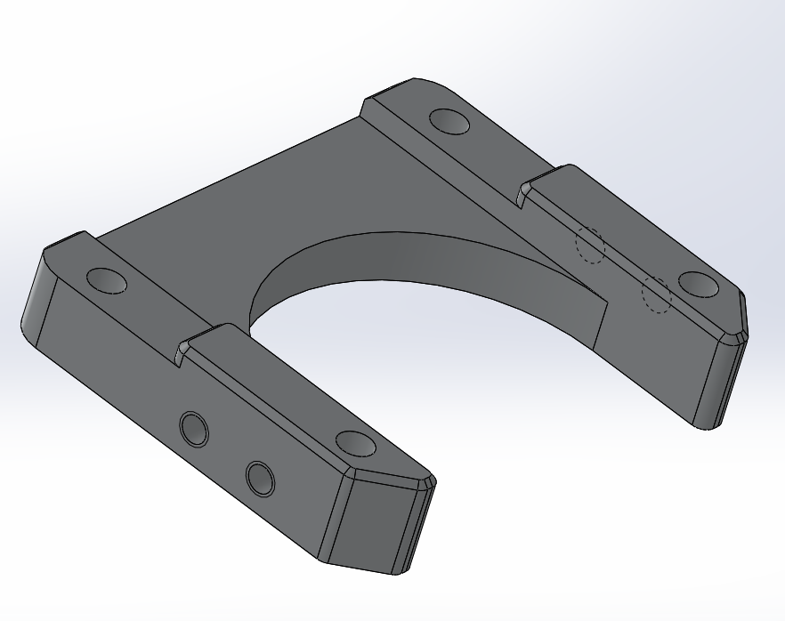
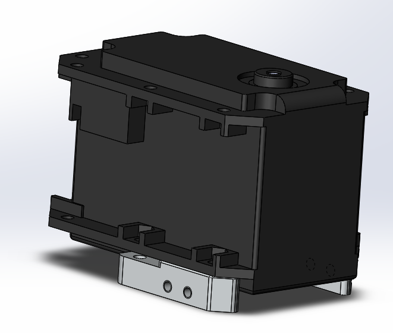
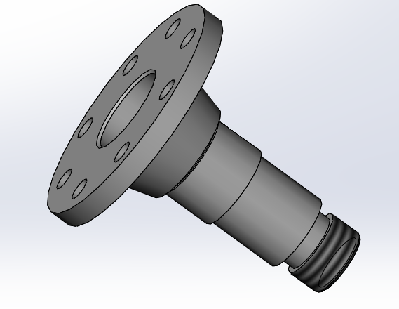
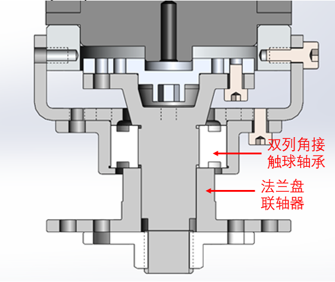
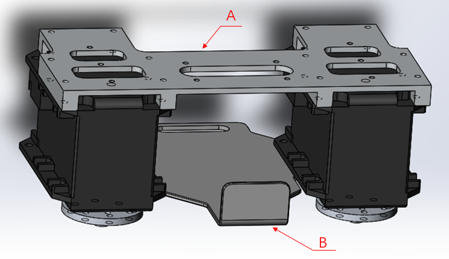
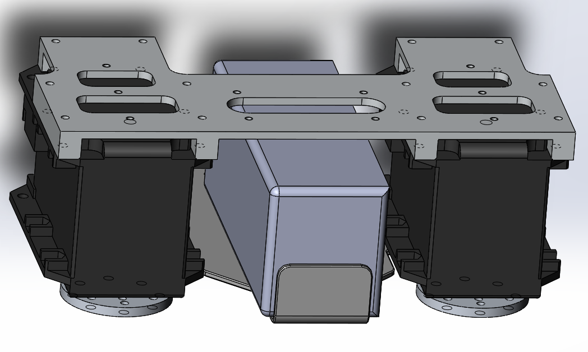
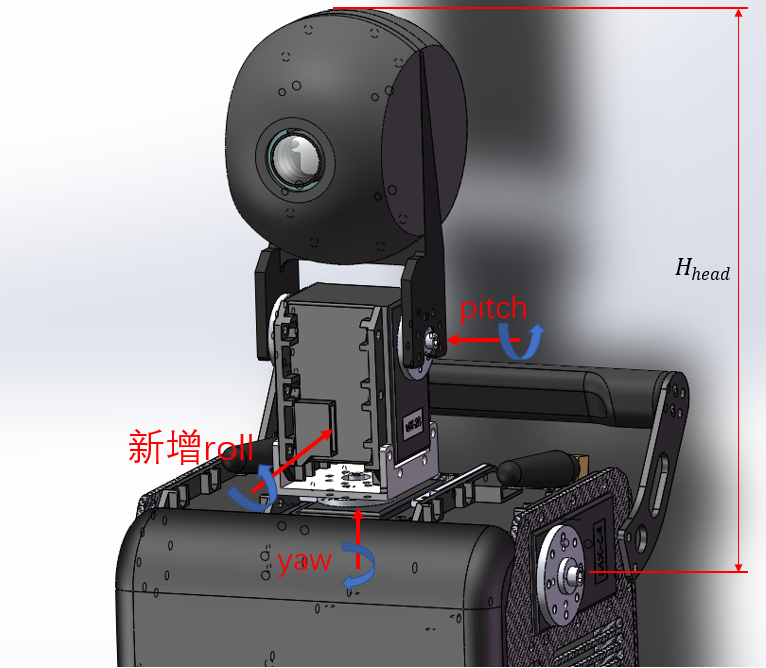

## ZJUDancer机械部分题目（若与pdf版本有不同，以pdf版为准）

该纳新题目的主要目的是让新同学可以在暑期提前熟练使用Solidworks2016，其次是锻炼机械设计的能力。

鉴于大二刚升大三的同学所学机械相关知识较少，且仍然有部分同学从未使用过Solidworks，故此纳新题目分为入门、普通和拔高三个难度。（入门必做，普通、进阶选做）。

**推荐使用Solidworks2016完成题目**

### <span style="color:red">入门 ：零件绘制和工程图绘制</span>

#### 1. 髋部电机连接座



零件在Solidworks中打开如上左图所示，现给出其.step格式文件以供参考，请你在Solidworks2016中绘制出它的零件模型和对应的工程图。

**具体步骤：**

- 打开.step格式文件。在文件夹中找到.step格式文件，首先打开```Solidworks2016->文件->打开->髋部电机连接座-64.STEP->输入诊断：否->特征识别：否```。这时你得到了零件模型，但丢失了螺纹信息，你可以忽略此细节。
- 测绘具体尺寸。通过Solidworks评估中的测量工具你可以测量你所需要的尺寸信息来帮助你绘制该零件。
- 创建零件。具体请参考Solidworks指导教程。
- 绘制工程图。具体请参考Solidworks指导教程并遵循工图课所学知识。需要注意的是：该零件是与MX-64舵机连接的，如上右图所示，没有特别的配合要求，但你可以参考该图合理地标注某些定位尺寸和基准。

**最终你应提交一份```.sldprt```格式文件和一份```.slddrw```格式文件。**

**提供：**

```“题目1”文件夹->髋部电机连接座-64.STEP```

#### 2. 转轴



零件在Solidworks中打开如上左图所示，现给出其.step格式文件以供参考，请你在Solidworks2016中绘制出它的零件模型和对应的工程图。

**具体步骤：**

- 打开```.step```格式文件。在文件夹中找到```.step```格式文件，首先打开```Solidworks2016->文件->打开->转轴.STEP->输入诊断：否->特征识别：否```。这时你得到了零件模型，但丢失了螺纹信息，这里直接告诉你轴的小端为M8外螺纹。
- 测绘具体尺寸。通过Solidworks评估中的测量工具你可以测量你所需要的尺寸信息来帮助你绘制该零件。
- 创建零件。具体请参考Solidworks指导教程。
- 绘制工程图。具体请参考Solidworks指导教程并遵循工图课所学知识。需要注意的是：该零件是一系列轴系结构中的转轴，如上右图所示为装配体的剖视图，其中，法兰盘联轴器这一零件的中间通孔形状是与转轴对应位置的横截面形状是一致的，请依据机械设计中的知识合理标注尺寸公差和粗糙度。

**最终你应提交一份**```.sldprt```格式文件和一份```.slddrw```格式文件**。

**提供：**

``` “题目1”文件夹->转轴.STEP```

### <span style="color:blue">普通 ：电池盒设计</span>

机器人的能量来源是电池，而由于空间限制和比赛时快速换电池的需要，电池的摆放位置和存取装置就显得尤为重要。我们的机器人当前在运行时通常同时使用两个电池，一个放在髋部，一个放在背部。现在简单介绍一下机器人髋部的电池存取装置。




机器人的髋部如图所示，由两个控制腿部偏航角的舵机以及连接它们的上下两块连接板组成，其中，上面的髋部电机固定板（零件A）起主要固定作用和与胸腔连接的作用，而下面的电机连接板（零件B）则起辅助固定和放置电池的作用。

放置完电池后如下图所示



以往我们是用海绵与魔术贴来固定和存取电池（这里不详细说明具体做法），这样的设计简单粗暴，但时不时会出现由于操作人员误操作或强力胶老化或比赛时机器人激烈碰撞而导致的比赛时电池掉落的问题。现欲在髋部这设计一个电池盒以方便存取电池且耐冲击，有可能的话应能同时存放两块电池。

**具体要求：**

在不改动电机固定板（零件A）和两个舵机的前提下在两个舵机间设计一“电池盒”，具体形式不限（不一定是盒子，能实现功能即可），要求：方便取放电池，耐冲击，有一定的使用寿命，可以适当改动电机连接板（零件B），但不能失去辅助固定的作用。如果可能的话请设计一能同时存放两个电池的“电池仓”，这时你很有可能得改动电机连接板（零件B）。

**最终你应该提交一份```.pdf```格式的设计说明书（大致说明你这样设计的理由及合理性）、若干份```.sldprt```格式文件（你所设计的各个新零件）和一份```.sldasm```格式文件(装配好你设计的电池盒后的髋部装配体模型)。**

 **提供：**

 ```“题目2”文件夹-> “简易髋部”文件夹->简易髋部.SLDASM  & 电池.SLDPRT```

### <span style="color:blue">进阶 ：头部减震装置设计</span>

**前言：**

机器人在行走过程中给头部带来的颠簸是各个方向的，其中横滚（roll）方向的振动最为严重，极大地影响了机器视觉系统的准确性，大多数高端仿人机器人和摄像机都配有一定的减震措施，而当前我们队伍的机器人仍未有从物理层面的减震设计，故现欲在机械结构方面设计一头部减震装置。

说到减震，让人联想到汽车中的悬挂系统和精密测量实验用的隔振台，而它们的原理都是基于质量-弹簧-阻尼系统的衰减振动，这种系统能用来设计成针对自由响应的阻尼弹簧隔振器和针对受迫振动的阻尼吸振器。这种装置简单粗暴，模型易于设计，故现想做一尝试，在头部设计一系列机构以构成一质量-弹簧-阻尼系统以达到对roll方向的吸振效果。

**设计要求与条件如下：**

- 机器人的头部如图所示，目前具有两个自由度，分别为yaw（偏航）和pitch（俯仰）。在保持这两个自由度不受影响的情况下，增加roll自由度，可以对零件进行改动与增删，但需要保持头部高度不变（头部高度即肩部第一关节的轴线到头顶的数值距离）。

  

- 在行走过程中，头部以下（具体而言即胸腔内控制头部yaw方向的舵机）对头部主动施加的roll方向的受迫振动振幅为10°，频率为1.5Hz，头部质量合计约为300g。

**你需要做的是：**

- 按上述要求选择合适的弹簧与阻尼器类型，设计一合理的能与头部配合的弹簧阻尼装置，绘制其Solidworks零件和装配体模型，不要求弹簧与阻尼装置的具体参数k与c，最终得到的是改进后的头部模型。
- 结合振动力学知识选择合适的k与c，并重新对你所选择的弹簧与阻尼器进行选型（选择一在市面上能买到的大致符合要求的即可，不要求非常准确），如有需要对第一步中的模型进行适当改动。（量力而行）

**为完成1，你可能需要的知识：**

- 熟练使用solidworks的零件绘制与装配体功能
- 大致了解常用的弹簧与阻尼器
- 可能需要用到轴承与轴系设计的知识，可以参考机械设计课本第几第几章节

**为完成2，你可能需要的知识：**

- 振动力学知识：有阻尼系统的受迫振动（机电专业大三下选修课程）

- 详细调研市面上的弹簧与阻尼器

**最终你应提交一份```.pdf```格式的设计说明书（说明你的设计的合理性、弹簧-阻尼的选型等）、若干份```.sldprt```格式文件（你所设计的各个新零件）和一份```.sldasm```格式文件(装配好你设计的减震系统后的头部装配体模型)。**

**提供：**

``` “题目3”文件夹->“简易头胸装配体”文件夹->简易头胸装配体.SLDASM```

​                        ```->“头部装配体”文件夹->头部.SLDASM```

---

针对以上题目描述，如有疑问请联系邮箱1003726422@qq.com。