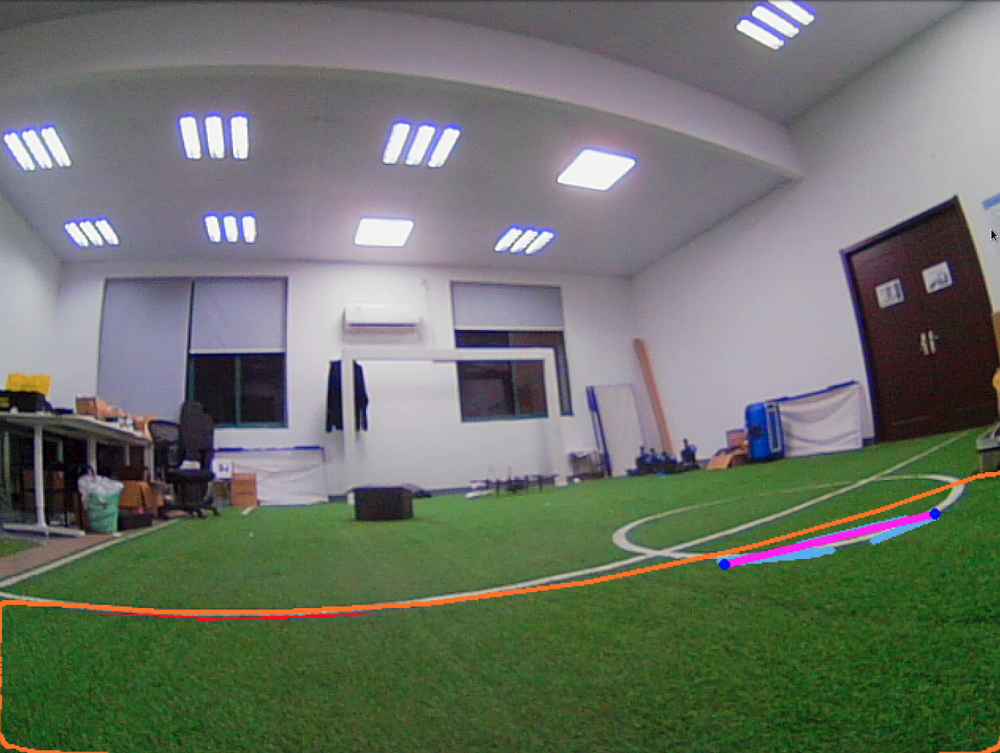
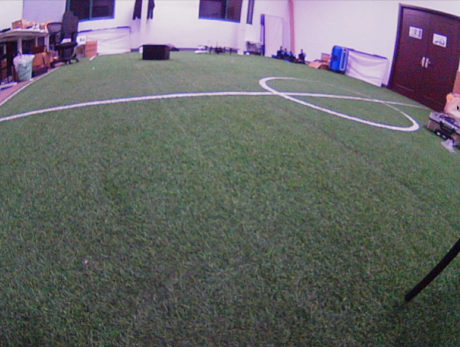
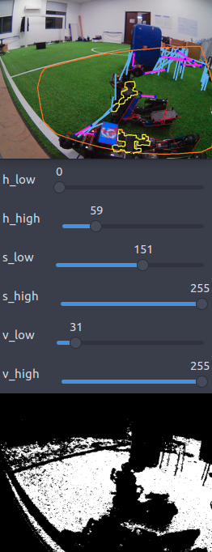

## ZJUDancer软件部分题目

**注意使用C++，并使用Git管理代码**，建议使用Ubuntu系统。

关于Git的学习，可以参考：

- 廖雪峰的[中文教程](https://www.liaoxuefeng.com/wiki/896043488029600)
- Github的[互动式课程](https://lab.github.com/)
- Atlassian也有一个[简明的Git教程](https://www.atlassian.com/git/tutorials)
- 如果需要深入了解Git是如何进行版本管理的，可以参考[A Hacker's Guide to Git](https://wildlyinaccurate.com/a-hackers-guide-to-git)

### 【1】固定白平衡（提供[空项目](https://github.com/ZJUDancer/white-balancer-example)）

- **背景**：使用相机的自动白平衡会导致低头看草地和抬头看远处（图像中出现白色背景）时参数差距过大，而相机驱动接口的手动白平衡仅开放一个接口参数，无法对RGB的gain进行分别调整，效果极差。如下图所示，分别为抬头与低头时的图像，低头状态下自动白平衡调整导致整体图像颜色偏红。

- **要求**：能通过主动用摄像头拍摄灰卡的方式，手动校准白平衡，并固定当前参数。

- **途径**：以下两种方法任选其一：
  1. 修改或完善相机驱动，通过底层接口将相机白平衡固定在一个较好的参数；
  2. 在现有驱动的接口下，固定一个手动白平衡色温数值，并通过手动标定的白平衡参数对每帧图像手动进行软件白平衡处理。

> 如使用空项目请将项目仓库fork到自己帐号下。测试用视频发布于空项目的release中。

### 【2】自适应hsv阈值（或者选框，提供[空项目](https://github.com/ZJUDancer/color-segmentation-example)）

- **背景与需求**：目前的检测需设定hsv通道下的阈值，在比赛（换场地、光线变化等）调试时十分繁杂。

- **途径**：需要根据场地使用自适应的方法确定阈值（给定图像确定阈值），或者在GUI的图像中框选部分图像确定阈值，简化参数调整。

> 如使用空项目请将项目仓库fork到自己帐号下。测试用图片、视频发布于空项目的release中。

### 【3】白线检测的并行加速

- **背景**：目前的白线检测耗时较长，在其流程中，有许多可以利用GPU加速或者进行并行化的部分。

- **需求**：将机器人上单次白线检测的时间缩短至10ms以内。

- **途径**：使用`cv::cuda`、`cv::parallel_for_`或者直接调用OpenMP、TBB等并行化库，对于白线检测进行加速。详见补充材料，请联系队员获取。

### 【4】Vision Compass

- **背景**：目前机器人使用IMU加上视觉校正来实现自身相对于场地的角度的判断，我们需要更多的可靠观测来实现视觉校正。
- **需求**：使用初步的视觉罗盘，为场地角的视觉校正提供新的观测。
- **途径**：
  1. 用机器人在场地上事先对环境构建全景地图；
  2. 机器人在场地上任意位置拍摄图像，通过特征匹配等方式，将当前帧与先验地图进行匹配，获得当前机器人的场地角。

### 【5】罚球点检测

- **背景**：守门员在处于防守状态时，能够观测到的landmarks有限，导致其自定位效果不佳。
- **需求**：针对球门前的罚球点进行检测，增强守门员自定位效果。
- **途径**：
  1. 用目标检测方法对罚球点初步检测；
  2. 并用白线、位置等对检测结果进行限制，获得可信的罚球点位置，辅助守门员定位。

---

题【1】、【2】的空项目仓库将于2019.7.21前公开。

针对以上题目描述，如有疑问请联系邮箱zjudancer@gmail.com。
